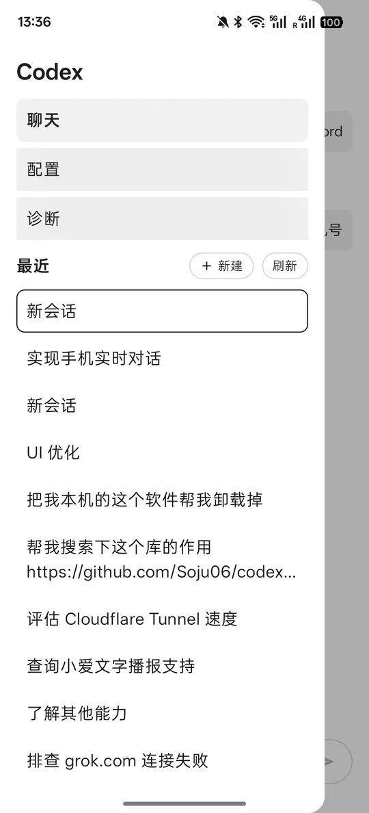
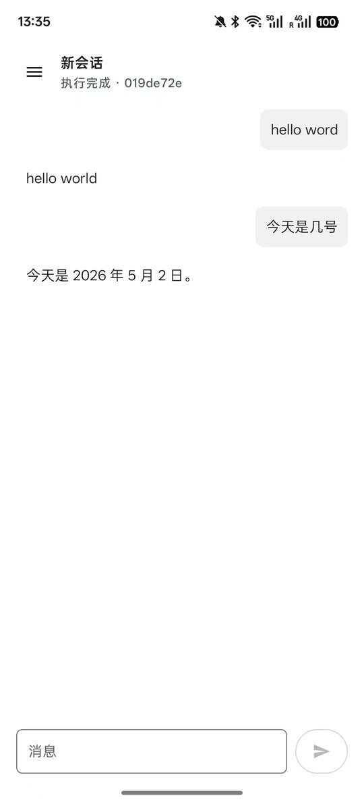
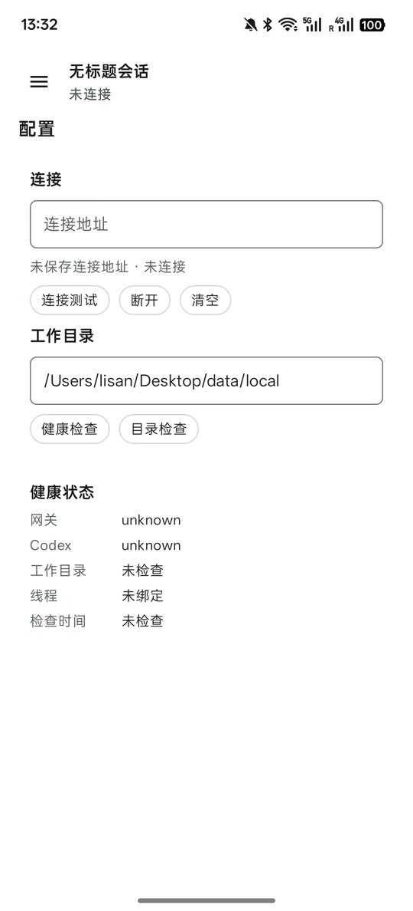

# Codex App

本项目提供一个自用 Codex 手机端入口：

- `server`：监听 `127.0.0.1:8000` 的本地网关，负责鉴权、连接 Codex app-server、转发实时输出。
- `android`：Android 原生 Kotlin 客户端，通过 WebSocket 连接 `https://xxx.com`。

## 界面预览

<table>
  <tr>
    <td align="center" width="33%">
      <strong>会话侧边栏</strong><br />
      <sub>线程列表、新建会话和快速切换</sub>
    </td>
    <td align="center" width="33%">
      <strong>实时聊天</strong><br />
      <sub>用户消息右侧展示，Codex 回复左侧展示</sub>
    </td>
    <td align="center" width="33%">
      <strong>配置与检查</strong><br />
      <sub>连接测试、健康检查和工作目录检查</sub>
    </td>
  </tr>
  <tr>
    <td align="center">
      
    </td>
    <td align="center">
      
    </td>
    <td align="center">
      
    </td>
  </tr>
</table>

## 功能特性

- 手机端连接本机 Codex Gateway，复用 Codex 线程能力。
- 支持新建会话、切换会话、历史同步和实时回复。
- 提供配置页、健康检查、目录检查和诊断日志。
- 支持 macOS `launchd` 和 Windows 计划任务常驻运行。
- 连接地址和 token 只保存在手机本地加密存储，不写入仓库。

## 配置文件

复制模板并改成本机配置：

```bash
cp server/.env.example server/.env
```

最小配置：

```env
CODEX_MOBILE_TOKEN=替换为至少16位随机token
CODEX_BINARY=codex
```

`CODEX_THREAD_ID` 可选。不配置时，网关启动会自动创建一个默认 Codex 线程；手机端发起新会话时会创建并绑定新线程。

`CODEX_MOBILE_DEFAULT_CWD` 也可选。不配置时，脚本会默认使用当前项目根目录；迁移到其他目录或 Windows 时通常不需要改路径。

手机端连接示例：

```text
https://xxx.com?token=替换为你的长随机token
```

## 内网穿透

建议使用 Cloudflare Tunnel 把公网域名转发到本机网关 `127.0.0.1:8000`，这样手机端可以通过 HTTPS/WSS 连接本地 Codex Gateway。

Cloudflare Tunnel 的桌面端常驻、域名映射和开机启动配置，可以参考项目：[cloudflare-tunnel-desktop](https://github.com/18230/cloudflare-tunnel-desktop)。

## 本地启动

```bash
cd server
npm install
npm run build
CODEX_MOBILE_TOKEN='替换为你的长随机token' npm run start
```

网关默认监听：

```text
http://127.0.0.1:8000
```

## macOS 常驻

```bash
cd server
npm install
npm run build
bin/install-launchd.sh
```

运行配置保存在项目目录内，并在安装时同步到运行目录：

```text
server/.env
~/Library/Application Support/CodexMobileGateway/runtime/.env
```

日志位置：

```text
~/Library/Logs/CodexMobileGateway/gateway.log
~/Library/Logs/CodexMobileGateway/gateway.err.log
```

卸载：

```bash
cd server
bin/uninstall-launchd.sh
```

## Windows 常驻

先准备配置文件：

```powershell
Copy-Item server\.env.example server\.env
notepad server\.env
```

安装计划任务并启动：

```powershell
cd server
powershell -ExecutionPolicy Bypass -File .\bin\install-windows-task.ps1
```

卸载：

```powershell
powershell -ExecutionPolicy Bypass -File .\bin\uninstall-windows-task.ps1
```

Windows 上 `CODEX_BINARY` 需要配置为本机 Codex 可执行文件路径，或者保证 `codex` 已在 `PATH` 中。

## 长连接心跳

- 服务端每 15 秒发送 WebSocket ping，45 秒没有收到 pong 或任何消息就关闭半开连接。
- Android 客户端每 25 秒发送业务心跳，并启用 OkHttp 底层 ping。
- Android 客户端断线后会自动指数退避重连，重连成功后自动恢复当前 thread 并刷新线程列表。

## Android 调试

```bash
cd android
./gradlew installDebug
```

如果需要指定设备：

```bash
adb devices
adb -s 设备序列号 install -r app/build/outputs/apk/debug/app-debug.apk
```
